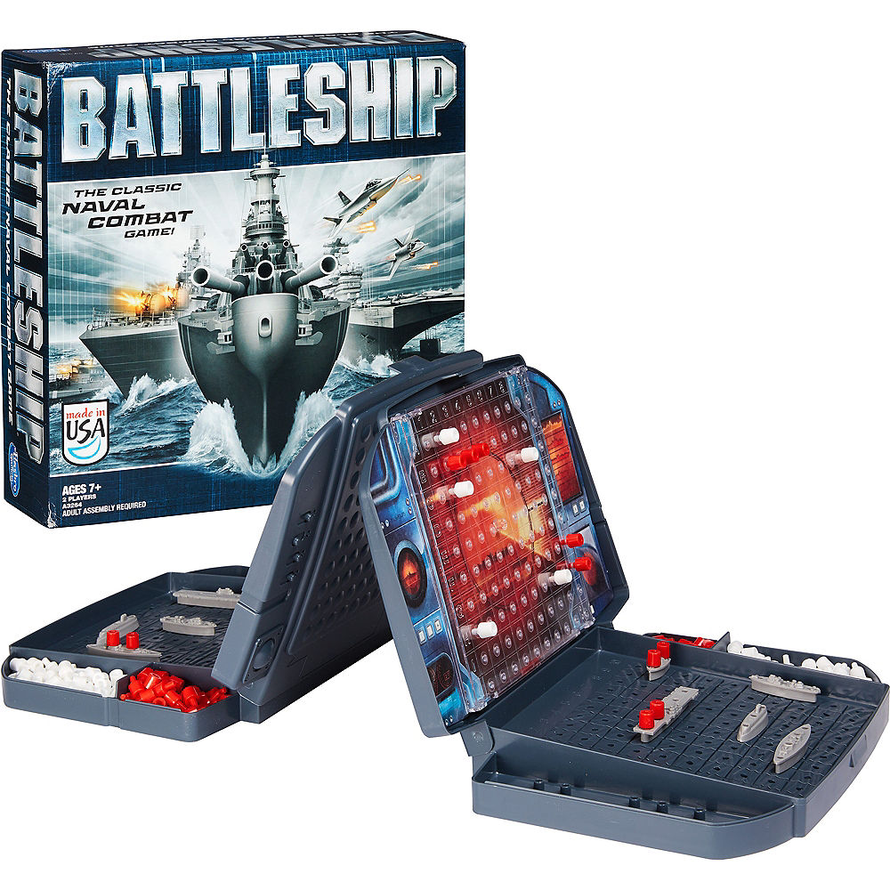

# [Obligatory Assignment 2: “Battleship”](https://retting.ii.uib.no/inf101.v19.sem2/blob/master/SEM-2.md)

* [README](README.md) – you need to write things here
* **Assignment instructions**

## Learning outcomes
- Learning to design software from scratch and making your own design decisions.
- Implementing and testing your design on your own.
- Creating documentation and describing and motivating design choices.

## Battleship
In this assignment you're going to implement the game [Battleship](https://en.wikipedia.org/wiki/Battleship_(game)) according to the according to the [2002 Hasbro rules](https://www.hasbro.com/common/instruct/BattleShip_(2002).PDF) with one player controlled by you (the human) and the other by the computer (AI). 



Traditionally, you would play this game with two human players. The players both place their own ships on a map that the opponent cannot see. The players then take turns guessing where the other player's ships are located, and the goal is to sink all of the opponent's ships by firing at them until all the positions covered by the ships have been hit. You can see an exciting video of the game [here](https://www.youtube.com/watch?v=Lzh8msRIHM0), (and laugh at the Dutch language!) or in English [here](https://www.youtube.com/watch?v=q0qpQ8doUp8). These days, you can even play Battleship against strangers on the internet [here](http://en.battleship-game.org/). **Note that the rules of this implementation are different from the rules you should use.**


You're going to create a program for playing Battleship. You decide yourself how to create the user interface, how to organize the code, what abstractions to use, and what to name classes, interfaces etc. You've received an empty Java project in which you should implement the game. Other than that, it's up to you how to develop the game. However, we'll score the assignment (0-100 points) based on how well you've used what you've learned in the INF101 course. We'll provide some design considerations and suggestions to help you get started, as well as, for those among you craving excitement, some ideas on how to make the assignment more interesting.

**Remember that you can (and probably should!) ask for help during the project in the group sessions!** We spend tax money on having teaching assistants for the explicit reason of helping you. So when you're wondering about something, are unsure of if what you did is a good choice or if you get stuck, please take advantage of the services provided by them. Even if you feel embarrassed asking about something you feel you should know already, or if you feel completely lost (we receive emails from students explaining this is the reason they haven't asked the teaching assistants in every course). Just formulating the question helps you understand what it is you don't understand. 
In this assignment, You're supposed to get the game working, and we're here to help you do so. We're letting you start from scratch to give you experience working in this way, not to test if you "know everything" before you start.

## Handing in
Get the code from:

    https://retting.ii.uib.no/<username>/inf101.v19.sem2.git

(Remember to replace `<username>` with your username.) This repository contains the assignment instructions and an empty Java project. You need to develop the program in this project and push to the repository as you've done previously. When grading your solution we'll look for:

* A working Battleship game that can be played alone against the computer (AI).
* [README-fil](README.md) explaining design choices, how the code is organized, what abstractions are used and other things we need to know about your code.
* Tests
* Documentation (JavaDoc, comments, diagrams, README, etc.)
* Carefully named classes, interfaces, methods and variables.
* Carefully chosen abstractions and encapsulation (use of classes, interfaces, methods, etc). - explained in README

You may discuss the assignment with others (in fact, we encourage it), but you have to write the code yourself and you need to write in README.md if specific design choices in your program are due to a discussion with someone. See also the section on [code review below](SEM-2.md#code-review)

## The program
The goal of the assignment is to create a working implementation of Battleship, where a human controls one side and the computer (an AI) controls the other side. The requirements are:

* The game is playable according to the traditional rules for Battleship: [2002 Hasbro rules](https://www.hasbro.com/common/instruct/BattleShip_(2002).PDF)
* The game has a [user interface](SEM-2.md#user-interface) that displays the necessary information to the user (where the ships are, where the player and AI have fired previously, showing if someone has won) and allows the user to input moves. The user interface can be either text based, using e.g., `System.out.println` and a `Scanner` object, or a graphical user interface that can be controlled by clicking.
* You've implemented a computer (AI) player. The AI player doesn't have to be very intelligent. It's sufficient to have it make random valid moves.
* Your code clearly shows how you've used object-oriented programming to create an [abstraction](#abstraction) of the real physical game using good classnames, interfaces, method names, field variables etc. Please carefully describe how these things fit together in README.md.

## Grading

The number of points we give depends on how good your implementation is and demonstrates that you have learned the important concepts in INF101. Battleship is relatively simple and *can* be implemented in one file without classes and methods (INF100-style). If you solve the assignment in this way you'll receive close to 0 points. We expect that the program works approximately as intended, but to receive a high score you also need to show that you can use object oriented programming effectively and that you can write tests and documentation. **It's better to deliver an implementation that is nicely organized and utilizes excellent abstractions in the spirit of object oriented programming that doesn't work exactly as specified than it is to hand in a fully working game that is poorly designed, organized and/or is missing tests/documentation.**

We expect that the game works, that you're using classes in a way that makes sense (see below) and that these are documented well and have tests. If your implementation is missing something we'll deduct fewer points if you explain in README.md what the problem is and how you would have solved it. This is also true for design decisions. If it turns out that one of your design choices gives you problems, we'll deduct fewer points if you explain what you learned from the experience and what you'd have done differently, even if you don't have time to change the implementation.

## Code Review

*This part isn't mandatory, but makes you a better programmer and helps you prepare the assignment.*

Explaining how your code works to someone else and figuring out how someone else's code works are great ways to build understanding (explaining how the code works to yourself is also a fantastic way to find bugs and is referred to as [rubber duck debugging](https://rubberduckdebugging.com/)). Therefore, we recommend that you gather in groups of, say, 2-4 students and do some [lightweight](http://codingsight.com/lightweight-code-review/) [code review](https://en.wikipedia.org/wiki/Software_peer_review) of each other's code:

* It can be practical to discuss things together around the same computer, and explain your code to someone else or try to understand someone's code. 
* You can also give access to your repository to someone else [as in lab 4](https://retting.ii.uib.no/inf101.v19.oppgaver/inf101.v19.lab4/blob/master/LAB-4-I_GIT.md#11-tilgang) and have them clone and test your code. The point is to give constructive feedback in order to learn and improve the code quality.
* Remember to comment what form of code review, if any, you used, what you changed and so on due to code review in [README.md](README.md).

## Design

In this section, we describe some abstractions often used in a project like this. You're free to do it another way, however. Remember to explain your abstractions in README.md regardless of how you choose to approach abstraction. Helping us understand what's going on may save you from unnecessary point deductions.

The individual parts of the program should be as cleanly separated as possible (encapsulated). You can achieve this for example by using different packages and avoiding unnecessary function calls between classes/packages/etc. **If you've done it well you should be able to replace any one component (e.g., the user interface or AI) without changing any other parts of the code.**

### Main loop

Your program needs a core that ties it all together. The core is typically a class with a loop where each iteration corresponds to one round of the game. To write the main loop you need to be able to answer these questions. You'll save time by writing down the answers before you start writing.

* What happens exactly in each round?
* What does each round have in common?
* What's different when the computer (AI) makes a move from when the human player makes a move?
* What happens only when the game starts, but not in each round?

Since all player rounds look alike, and all game rounds (from beginning to end) look alike, you could make a nested loop:

```java
main(){
loop until program should stop {
    initialize the game;
    loop per single game {
        reset the board to prepare for a new round;
        loop per round {
            do things required in each round;
        }
    }
}
```
By loop we mean any of for, while, do-while. You have to decide which kind of loop is right for each case. This is a good place to use iterators.

### Abstractions

Here are some abstractions tips:

* Game: Contains the components that make up a game, e.g., board, players, markers.
* Ship: Stores the properties of a ship.
* Board: Contains the current state of the board and provides methods for changing the game state. Contains ships.
* Player: Contains all functionality for making a move in the game. The Game abstraction asks the Player abstraction to make a move and then changes the game state accordingly. For a human player the player abstraction would ask for user input and for the computer AI player the choice would be made automatically. You could consider a Player interface that is implemented by both the human and computer player.
* Rules: Could be used to check that a given move is legal and figure out if a player has won (win conditions). Separating the rules from the rest of the game allows you to change the rules without changing anything else in your code. For example, maybe you want to implement alternative game modes and rulesets as a bonus feature.

### User interface

The user interface is the part of the program that accepts input from the player (typically keyboard key presses or mouse clicks) and displays the program output (the current state of the game board, what happened due to something the player did and what the player should do next). 

You can either create a text-based interface that uses text characters in a terminal window to show what's going on or you can create a [graphical user interface](https://www.youtube.com/watch?v=lNN2i5nWJy4) in a separate window. A text based interface is fine. It's more important that you separate the user interface code cleanly (modular code) from the rest of the code and that this is well documented.

How well you've managed to separate the user interface code from the rest is measured by how easy it is for you to use someone else's user interface in your game. It should be relatively easy if you have a smart API, and should require few changes in your code. If you agree on a good way to separate the user interface from the rest with someone else, you've effectively developed a standard!

*It's not a requirement to switch user interface with someone else, but if you can do it without too much work you're in very good shape!*

#### (pro) tips

Some (pro) tips for implementing the user interface:

* ...use console-I/O with `Scanner` and `System.out.println()`.
* ...copy the graphics library from another assignment, e.g.,  [the first obligatory assignment](https://retting.ii.uib.no/inf101.v19.oppgaver/inf101.v19.sem1/tree/master/src/inf101/v19/gfx). The graphics can be drawn with text as in the obligatory assignment, or with turtle graphics or shapes – see, for example, how the ducks are drawn in [Lab 6](https://retting.ii.uib.no/inf101.v19.oppgaver/inf101.v19.lab6/blob/master/src/inf101/v19/pond/Duck.java). See [the Main class](https://retting.ii.uib.no/inf101.v19.oppgaver/inf101.v19.sem1/blob/master/src/inf101/v19/rogue101/Main.java) for setup (can be made much simpler than in the first obligatory), and to see how you can register keyboard input.
* ...use [Swing](https://docs.oracle.com/javase/tutorial/uiswing/components/index.html) or [JavaFX](https://docs.oracle.com/javase/8/javafx/get-started-tutorial/jfx-overview.htm) to create an interface. You'll have to invest some time to learn how these libraries work. See, e.g., [JavaFX 8 GUI Tutorial](https://code.makery.ch/library/javafx-8-tutorial/).

## Getting started

There are two main approaches for getting started with this project.

I (Albin) recommend that you start by implementing the basic game in one or two files and that you get something that sort of works. Once you have a partial implementation I recommend that you start thinking more carefully about what properties Battleship has and how you can represent these using abstractions. Think about which classes you need, what they should contain and how they should fit together. This will be made easier by you having worked on the problem for a bit already. See [the modeling part of the first obligatory](https://retting.ii.uib.no/inf101.v19.oppgaver/inf101.v19.sem1/blob/master/SEM-1_DEL-A.md#oversikt-modellering) for an example. Once you have an idea on what abstractions you need you can start converting your current program into the one you envisioned (this process is referred to as [refactoring](https://en.wikipedia.org/wiki/Code_refactoring)). You will typically have to stop, rethink your design choices and refactor several times during the project.

Alternatively, you can start by thinking about what the essential properties of the real game of Battleship are, and how you can abstract from them in your implementation. You can consider what interfaces and classes you think you'll need, what methods and field variables, and maybe write tests for this already. See [the modeling part of the first obligatory](https://retting.ii.uib.no/inf101.v19.oppgaver/inf101.v19.sem1/blob/master/SEM-1_DEL-A.md#oversikt-modellering) for an example. 

You can of course also choose to go with a combination of these two approaches.

### Useful INF101 concepts

***This isn't a check list of things you need and isn't complete.*** This is a list of INF101 concepts that may be useful and how to use them. You surely have to use things not on the list and you don't need to use everything on the list if it doesn't fit.

* **Interfaces**. It's natural to use interfaces to define behavior for your classes. Then you can use the interface type instead of the class type to declare variables. This makes your program modular and allows parts of it to easily be exchanged.
* **Inheritance**. If objects or classes share some functionality, you can improve code re-use by having one class inherit from the other, or moving the common functionality into a separate class that both inherit from.
* **Factory**. If you need to create a lot of objects from some class or if you need a lot of typical objects it may be a good idea to use a factory. Typically you should use a factory if you have code (if statements etc.) that you copy around in all places you create objects.
* **Tests**. Test your code as well as you can. See previous assignments for suggestions.
* **Preconditions**. Add preconditions to methods and constructors where useful.
* **Data invariant**. Add data invariant (checking that field variables have a valid combination of values) to your classes where you can. This will help with debugging and counts as part of the documentation.
* **Data structures**. See for example Grid from previous assignments.
* **Generic types**. Data structures should be generic. Perhaps also other parts of the program should be made generic.
* **Iterator**. You can use iterators in several ways. For example, you can iterate over players in the round-loop and over ships to check if they've all been sunk.
* **Class diagrams** It is strongly recommended to draw a UML diagram for your classes and how they fit together. This is very useful both for you and for the teaching assistants when they help you.
* ***Encapsulation*** Use private modifiers where you can and hide the internals of classes (variables exact implementation) from other parts of the program as well as you can. Interfaces are a nice way to accomplish this.

## Above and beyond

These are not requirements, but suggestions on things you can develop further if you like.

### Random events
To mix things up a little, you can add random events to your game. These events are executed in each round with a certain probability and change the state of the game. Examples are the following (but it can be anything fun, be creative!):

- Ships move around randomly.
- Storms or shark attacks that damage some of the ships (or parts of them).
- You get a partial glimpse at the other board briefly.

### Other rules

You can add alternative game modes to the game with, e.g., special attacks or the ability to move your ships around (but think of what this does to the gameplay!). A common variant of Battleship rules is for instance [salvo shooting](https://www.ultrabattleship.com/variations.php), where the players can shoot 3 times, and the opponent will only tell how many of the three shots were hits (and if so on what kind of vessel).

### Better AI

You can make the AI more intelligent in many ways. You can even develop several different AIs and have them compete against each other. Or brutally crush the AI your friend developed in 'friendly' competition.
